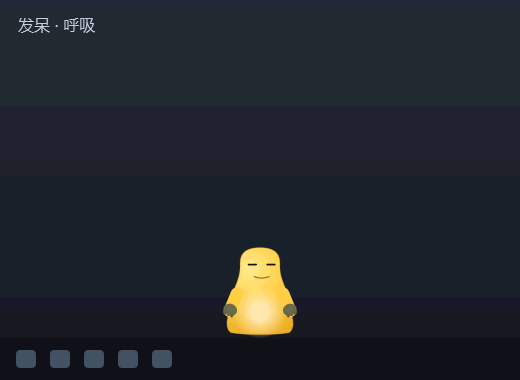
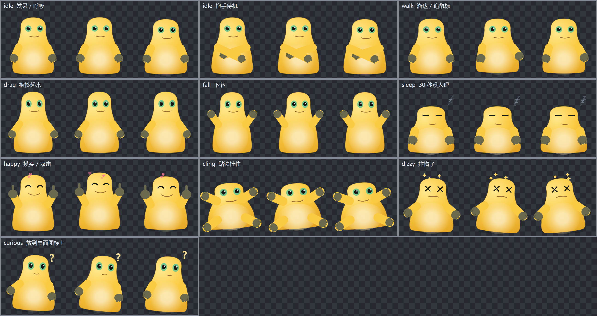

# v-pet

**一只住在你任务栏上的 Windows 桌面宠物。** 无边框、置顶、逐像素透明，
能抓起来甩出去、扒在屏幕边上、走过双屏之间的接缝。64 MB 免安装，冷启动 1.2 秒。

[](https://github.com/Alexsheng26/V-Pet/actions/workflows/ci.yml)
    



> **这张动图不是摆拍的。** 它由 `tools/make_demo.py` 驱动**真实的 `PetBrain`** 生成 ——
> 重力、落地反弹、摔懵的冲击判定、抱手的概率，全是产品代码算出来的，
> 脚本只负责在特定时刻喂进"抓起来 / 松手 / 摸头"这些用户输入。
> 生成器会自检：所有状态都得在图里出现过，落地冲击也要真的越过摔懵阈值，否则退出码非零。
>
> 顺带一提，**GIF 编码器也是手写的**（`tools/gif.py`，中位切分调色板 + LZW + 帧间差分）。
> Qt 只能读 GIF 不能写，标准库也没有，而为了一张文档配图引入 Pillow 不划算。

**English → [README.en.md](README.en.md)**

---

## 跑起来

```bash
pip install -r requirements.txt
python main.py
```

不需要任何素材文件 —— 角色是 `QPainter` 现画的。想要免安装的版本见[打包](#打包)。

## 角色是画的，不是贴的



> 由 `python tools/preview.py` 生成。棋盘格背景是为了让"哪里是真透明"一眼可见 ——
> 这类项目最容易翻车的地方就是以为画好了，贴到桌面上才发现边缘带一圈白底。


造型参考了一只网上流传的黄色团子（无颈梨形身体、奶油色肚子、大圆眼、深橄榄色的手），
但代码里是**照着造型重画**的，没有把参考图打包进仓库。两个原因：

1. 仓库是公开的，塞一张来源不明的图进来，素材版权上说不清楚；
2. 更实际的是 —— 位图做不到按状态换手势。举手、竖大拇指、抱手、摔懵时手往外张，
   都是按状态算出来的角度；扒墙那套四肢张开更是另起了一条画法。
   一张静态图只能整体形变，这些一个都做不了。

想换成自己的图也行，见下面的 `sprites/` 约定。

调型的时候反复画歪，最后定下来四个关键点，都写在 `render.py` 的注释里：

| 画错了会变成 | 关键在哪 |
|---|---|
| 鸡蛋 | 头顶那段的**末控制点必须压在 `top` 上**，切线水平头才是圆的 |
| 圆锥 | 最宽处到脸颊之间要留一道**很轻的腰**，否则看不出头和身体的分界 |
| 贴了颗发光蛋 | 肚子的渐变**过渡要长**，中心还不能压满不透明 —— 参考造型里肚子和身体之间没有边界 |
| 三只爪子 | 手指要和手掌**同色**，只用两道指缝分开。实心深色手指在 100px 级别下必然读成爪 |

身体用的是径向渐变而不是竖直线性渐变。参考图是 3D 渲染的软光，亮部集中在左上一小块、
四周向暗处滚落；线性渐变只能做出"上浅下深"的贴纸感，立不起来。

## 能玩什么

| 操作 | 反应 |
|---|---|
| 左键拖动 | 抓起来。松手带着甩出去的速度掉下来，落地弹两下 |
| 摔得够狠 | 摔懵，头顶转圈星星 |
| 拖到屏幕左右边缘松手 | **像蜘蛛侠一样扒在墙上** —— 四肢朝四角张开、身体压扁，还会慢慢往下滑 |
| 双击 / 在它身上来回搓 | 摸头，眯眼冒爱心 |
| 右键 → 跟着鼠标 | 追着光标跑；追上就停下，不会在原地抖 |
| 什么都不干 | 每次停下来有 45% 的概率抱起手，抱着手会站得更久 |
| 把它扔到窗口上方 | 站在窗口标题栏上溜达。窗口挪动它跟着走，窗口关掉它掉下来 |
| 拖到桌面图标上松手 | 落地后歪头打量，冒个问号 |
| 放着不管 30 秒 | 睡着，冒 z；点一下就醒 |
| 右键 / 托盘 → 大小 | 96 / 120 / 144 / 176 / 208 px，即时生效 |
| 右键 / 托盘 → 开机自启 | 默认关。勾上才会写 HKCU 的 Run 键 |
| 右键 / 托盘 | 打个盹、藏起来、退出 |
| Esc | 退出 |

位置、大小、跟随开关、自启状态都会记住，下次打开还在原地。

"来回搓"和"匀速划过去"是区分得开的：判定值每帧按 `RUB_DECAY` 衰减，
慢慢划过去攒的速度赶不上衰减，只有真的来回蹭才触发。

## 这个项目在解决什么问题

桌面宠物真正难的部分不是"宠物"，是"窗口"。宠物逻辑是一个几百行的状态机，
而下面这几件事每一件都能卡住一整个晚上：

### 1. 逐像素透明，不是抠图

`FramelessWindowHint` 去边框，`WA_TranslucentBackground` 打开真正的 alpha 通道，
所以角色边缘是抗锯齿的软边、投影是半透明的、爱心和星星能淡入淡出。

对比一下没选的方案：tkinter 的 `-transparentcolor` 是**色键透明**，只能整块抠掉某一种颜色，
边缘必然是硬的、会有白边，也做不了半透明投影。像素风角色勉强能用，软边角色直接废。
色键这个限制迟早会撞上，撞上再迁移等于重写整个渲染层 —— 所以一开始就付 PySide6 的依赖体积。

### 2. 点击穿透：方窗口装圆宠物

窗口是 144×144 的方块，宠物是圆的。如果四角那些完全透明的像素照样吃鼠标事件，
这只宠物就成了一块挡住桌面图标的隐形玻璃。

Qt 只能整个窗口开关 `WA_TransparentForMouseEvents`，做不到按像素判断，所以要下到 Win32
动态开关 `WS_EX_TRANSPARENT`。这里有个不太直觉的地方：**一旦设上 `WS_EX_TRANSPARENT`，
窗口就再也收不到任何鼠标事件了**，自然也没法靠 `enterEvent` 判断鼠标什么时候移回来 ——
只能用全局光标位置轮询。

判定依据直接复用当前帧的 alpha，所以渲染层返回的是 `QImage` 而不是直接往窗口上画：
省掉了为命中测试再渲染一遍。摸头的"搓"判定也挂在同一个轮询上 ——
那个循环每帧已经算出"光标在不在宠物身上"了，再累加一下光标位移就够了。

### 3. 配置写坏了，宠物就再也打不开了

配置存在 `%APPDATA%\v-pet\config.json`。这个文件的特殊之处在于**它坏掉的后果不成比例**：
一个没有主窗口、没有控制台的桌面宠物，启动失败时连报错的地方都没有，
用户看到的只是"双击了没反应"。所以 `config.py` 有三条硬要求：

- **原子写** —— 先写同目录下的临时文件再 `os.replace`。直接 `open(path,"w")` 的话，
  写到一半崩溃就会留下半个 JSON。临时文件必须和目标同目录，跨文件系统的 replace 不是原子的。
- **容错读** —— 文件缺失、内容截断、根节点不是对象、字段类型不对，一律退回默认值，绝不抛异常。
- **字段逐个取** —— 少了的用默认值（旧配置能被新版本读），多了的直接忽略（新配置回退到旧版本也能读）。

`normalise()` 还负责把脏值收拾干净，比如坐标是字符串 `"120"` 就转成整数、
尺寸超范围就夹到合法区间。有一个不太直觉的特判：**`bool` 是 `int` 的子类**，
不挡一下的话 `{"x": true}` 会让宠物跑到横坐标 1 的位置去。

### 4. 恢复位置必须校验它还在不在屏幕上

存下来的坐标可能来自一块已经拔掉的显示器，或者分辨率被调小了。直接 `move()` 过去，
宠物就待在屏幕外面 —— 进程在跑、托盘图标也在，就是死活看不见。
所以 `_restore_position()` 会先确认那个矩形和某块屏幕的可用区域有交集，没有就忽略、走默认位置。

### 5. 多屏的"边界"不是一个矩形

单屏时边界就是屏幕矩形，多屏之后这个模型直接不成立：

- 屏幕之间的**接缝不是墙**，宠物该走过去；只有最外侧的边缘才是墙
- 两块屏可能高度不同、上下有偏移，**接缝处地面高度会变**
- 排列可能是 L 形或者错开的，于是存在**没有任何屏幕的死区**

最容易想到的做法是取所有屏幕的外接矩形当边界。它是错的：宠物会走进死区，
进程还在跑、托盘图标还在，人就是找不着它。所以 `screens.py` 保留每块屏各自的矩形，
逐块回答"能不能往那边走"。

换屏看的是宠物**中心**有没有越过接缝，不是整个窗口有没有出本屏 ——
后者会让宠物在离边缘一个身位的地方就被拦下，永远走不到接缝。跨越过程中窗口
同时压在两块屏上，本来就该这样。

接缝两侧地面不一样高时，往上是**迈台阶**（直接抬上去，不打断走路），
往下超过 12px 就是**走下了台阶**（切到下落状态，保留水平速度）。
贴边挂住也只在没有邻屏的那一侧生效，否则宠物会吊在双屏桌面的正中间。

屏幕配置变化用**指纹比对**检测，不接 `screenAdded` / `availableGeometryChanged` 那一堆信号：
新插上来的屏还得记得给它也接一遍，漏一个就是一个静默的错误状态。
每帧比几个整数元组的开销可以忽略。

### 6. 从桌面上读东西，三个不查文档就会踩的点

宠物能站在窗口标题栏上，也能认出脚下的桌面图标。这两件事都要问 Windows 要数据，
`desktop.py` 里每个坑都写了注释：

**窗口矩形要用 `DwmGetWindowAttribute(EXTENDED_FRAME_BOUNDS)`，不能用 `GetWindowRect`。**
后者含 Aero 的不可见投影边框，左右各多出七八个像素 —— 宠物会站在离窗口可见边缘
一段距离的空气上，肉眼一眼就能看出来。

**`IsWindowVisible` 挡不住 UWP 的幽灵窗口。** 它们"可见"但被 DWM 隐藏着，
只有 `DWMWA_CLOAKED` 属性能识别。不查这个的话，桌面上会凭空出现一排踩不到实物的台面 ——
实测本机 8 个可见顶层窗口里有 6 个是这种。

**桌面图标属于 explorer.exe，`LVM_GETITEMRECT` 要求把结果写进对方进程的地址空间。**
传本进程的指针只会拿到一堆零。所以得 `OpenProcess` + `VirtualAllocEx` 到 explorer 里
分配一块内存、发消息、再 `ReadProcessMemory` 读回来。拿不到就返回空列表 ——
这只是个锦上添花的功能，不值得让宠物崩掉。

另外两条判断是实测调出来的：

- **最大化窗口的上沿在 y=0，站上去整只都在屏幕外。** 所以台面查询带一个"天花板"
  参数，把"站上去放不下"的排掉。
- **窗口移动时按句柄认、不按位置认。** 第一版还要求宠物仍落在新位置的范围内，
  结果慢慢拖窗口没事、但 `Win+←` 这种一次挪半个屏的吸附会让宠物掉下去。
  站在窗口上的东西挪多远都该跟着走，位移直接补给宠物。

刷新频率是量出来的：枚举窗口 0.2ms，所以每 100ms 轮询一次；枚举图标 1.6ms
（约 10% 帧预算），所以**只在松手那一刻查一次**，不进每帧循环。

### 7. 崩了要留下痕迹

`console=False` 的窗口程序**没有可看的 stderr**。抛一个未捕获异常的表现就是
"宠物突然不见了" —— 托盘图标没了、窗口没了、什么都不留下。用户没法反馈
"它崩了，是这么崩的"，开发者也无从排查。这比崩溃本身更麻烦。

所以 `crashlog.py` 把 traceback 连同版本、平台、是否打包写进
`%APPDATA%\v-pet\crash.log`，窗口层再弹一条托盘通知告诉用户日志在哪。

有两处是实测才定下来的：

- **槽函数抛异常之后程序不会终止。** PySide6 6.11 会调 `sys.excepthook`，
  但事件循环照常跑下去 —— 而主循环是 60fps，同一个 bug 每秒会往日志里写 60 条。
  所以去重是**必需的，不是优化**；主循环那层还会主动 `timer.stop()`，
  否则那个 bug 每秒还要再犯 60 次。
- **崩溃处理器绝不能自己抛异常。** `record()` 整个包在 try 里，
  磁盘满、没权限一律返回 None —— 一个会崩的崩溃处理器比没有还糟。

### 8. 两只宠物会互相覆盖对方的配置

双击两次 exe 就有两只，而它们**写的是同一个 config.json** —— 位置、大小、
跟随开关互相覆盖，最后谁退出得晚谁说了算。开机自启之后再手动打开一次也会撞上，
而这恰恰是最容易发生的情况。

用**命名互斥量**而不是锁文件：进程无论怎么死（崩溃、任务管理器杀掉、断电），
系统都会自动释放。锁文件在这些情况下会留在磁盘上，程序**从此再也起不来** ——
那比没有保护更糟。

第二个实例不是闷声退出，而是**广播一条自定义窗口消息**让已经在跑的那只露个面。
否则用户看到的是"双击了没反应"，尤其在宠物正被"藏起来"的时候，他会以为程序坏了。

处理函数必须**幂等**：实测 `HWND_BROADCAST` 会投递给进程里*每一个*顶层窗口
（含 Qt 的隐藏辅助窗口），一次广播命中五次。

### 9. 退出路径要先于一切

无边框窗口没有关闭按钮。托盘菜单和 Esc 是在写第一行渲染代码之前接上的，
否则很容易做出一个只能开任务管理器杀掉的窗口。

## 分层

```
main.py            入口
vpet/state.py      行为：状态机 + 物理。不 import Qt
vpet/render.py     渲染：状态 -> QImage，含与角色无关的姿态系统
vpet/window.py     窗口：透明、置顶、拖拽、点击穿透、托盘、菜单
vpet/config.py     配置读写。不 import Qt
vpet/autostart.py  开机自启（HKCU 的 Run 键）
vpet/screens.py    多屏几何：接缝、死区、相邻判定。不 import Qt
vpet/ledges.py     可站的台面：落点、跟随移动。不 import Qt
vpet/desktop.py    Win32：枚举窗口上沿和桌面图标
vpet/crashlog.py   未捕获异常落地成日志。不 import Qt
vpet/instance.py   单实例保护（命名互斥量 + 唤醒广播）
vpet/paths.py      程序目录解析（打包后 __file__ 不再指向仓库）
tools/preview.py   生成状态对照图
tools/make_icon.py 从角色渲染多尺寸 .ico
tools/gif.py       手写的 GIF89a 编码器（调色板 + LZW + 帧间差分）
tools/make_demo.py 驱动真实 PetBrain 录出 README 的演示动图
tools/bundle.py    打包时要剔掉的 DLL 规则（spec 和 build.py 共用）
tools/build.py     打包 + 自检
v-pet.spec         PyInstaller 配置（手写的，要提交）
tests/             181 个测试，用 offscreen 平台跑，不需要显示器
```

三条切割线，都是为了让"改一边不用碰另一边"：

**行为 ⊥ Qt。** `state.py` 和 `screens.py` 一个像素都不画，只回答"现在什么状态、在哪"。
回报是行为逻辑能脱离 GUI 直接跑单元测试 —— 重力、贴边判定、甩出去的速度上限
这些手感参数，改完立刻能验证，不用真去拖一遍窗口。

**姿态 ⊥ 角色。** `pose_for()` 只说"这个状态该怎么挤压、拉伸、偏移、旋转"，
和这只宠物长什么样无关。所以接一张别的图进来当角色时，可以直接套同一套动画。

**渲染 ⊥ 素材。** 窗口只问 provider 要"当前这一帧"，不关心它是从 PNG 读的还是当场画的。
`State` 枚举的值直接就是目录名：

```
sprites/
  idle/  walk/  drag/  fall/  sleep/  happy/  cling/  dizzy/  curious/
```

丢进去就自动换皮，一行代码不用改；缺哪个状态就自动退回 `idle`，可以一个状态一个状态地补。
第一版**一帧图都不用画**是有意的 —— 素材才是这类项目真正的瓶颈，
不该让它挡住"系统能不能跑通"的验证。

## 扒在墙上：接触点必须在身体轮廓之外

贴墙这个动作改了三版，每一版失败的方式都不一样，最后收敛到一条规律。

**第一版：站着往墙上蹭一点。** 读起来像在挥手，完全没有贴住的感觉。

**第二版：整只转 90° 横贴。** 剪影是对的 —— 屏幕上一个横躺的形状压在边缘，
手也确确实实按在墙线上，几何完全正确。但读起来是**"躺倒"**而不是"扒住"。
（那一版还顺带解决了两个子问题：旋转支点要从脚底改到画布中心，否则 90° 会把
身体甩出画布；脸不能跟着转，否则眼睛竖着排。）

**第三版：正面朝观众，四肢朝四角张开。** 这版对了。

中间还试过"直立 + 倾斜 + 手臂上举"和"横贴 + 手臂张开"，都不行，原因指向同一条：

> **正面视角的 2D 角色，靠墙那侧的肢体会被身体自己挡住。**

所以任何"侧贴"画法都看不到接触点 —— 而看不到接触点，就读不出"扒住"。
横贴那版张开手臂反而更糟：手会朝**离开墙**的方向甩出去，连仅有的接触也丢了。

真正让人一眼认出"扒住"的，不是身体贴着哪条线，而是**四肢朝四个方向张开、
接触点拉得很开**。所以这一版不复用 `_arm_angles()` 那套"绕肩膀转的角度"——
那是给站立姿势设计的，只有两条肢体且都从体侧垂下。扒墙需要四个朝外的接触点，
用绝对方向角直接写更清楚。

几何是量出来的：一开始四肢顶出画布，测出"顶部空了 34px、左右和底部都顶死"，
于是整体上移 7px、张开幅度收到 `0.28w`。最外侧的手最终落在离屏幕边缘 2px 的位置。

## 抱手为什么不是一个状态

`Posture`（垂手 / 抱手）是 `State` 之外的一个维度，和 `follow` 一类。

把它做成 `State.CROSSED` 会有两个问题：`State` 的值直接就是 `sprites/` 的目录名，
于是凭空多出一个没人会去画的 `sprites/crossed/`；而且它和"在做什么"是正交的 ——
理论上走路也能抱着手，塞进状态机就得为每种组合各开一个状态。

行为层只决定"现在抱不抱"，渲染层决定"抱手长什么样"。`_arm_angles()` 那套角度模型
表达不了抱手 —— 它只能让手绕着自己那侧的肩转，而抱手要求前臂横过身体、手落在**对侧**，
所以抱手是单独一条画法。

## 状态机

```
   ┌─── 追鼠标模式只改 WALK 的方向，不新加状态 ───┐
   ↓                                              │
  IDLE ⇄ WALK ──(30s 没被打扰)──→ SLEEP ──(点击)──┘
   │ ↑ ↑
   │ │ └────────────── HAPPY ←──(双击/来回搓)
   │ │                   │
(按下)│                (2.2s)
   ↓ │(落稳且冲击小)        │
  DRAG ──(松手，离墙远)──→ FALL ──(冲击大)──→ DIZZY ──(1.8s)──┘
   │                        ↑
   └──(松手，离墙近且离地够高)─→ CLING ──(滑到底就站起来 / 6~15s 蹬墙)
```

## 四个只有测试才抓得到的 bug

都不是崩溃，是"看起来在跑，其实是错的"那类。

**宠物永远不会睡觉。** `_tick_walk` 每帧把发呆计时清零，而 `IDLE` 每 1.2–4 秒就切一次 `WALK`，
于是 30 秒的阈值永远攒不满。根子是语义搞混了：该重置计时的是"用户来打扰了"，
不是"它自己溜达了一圈"。肉眼盯窗口盯不出来，你得真的等满 30 秒还什么都不发生才会起疑。
→ `test_wandering_does_not_reset_the_sleep_timer`

**高 DPI 下宠物被裁边。** `render()` 里写了 `p.scale(dpr, dpr)`，但 `QPainter` 作用在设过
`devicePixelRatio` 的 `QImage` 上时会**自己**应用缩放，等于乘了两次。
在 100% 缩放的屏幕上（dpr=1）完全看不出来，一到 150% 就开始裁边。
回归测试的写法是：在 dpr = 1.0 / 1.5 / 2.0 下分别渲染，比较宠物在**逻辑坐标**下的包围盒 ——
物理像素数该变，逻辑尺寸不该变。
→ `test_logical_size_is_identical_across_dpr`

**开心时爱心被裁掉一角。** happy 的姿态本来就把整只往上抬，爱心再往上飘就顶出画布了。
麻烦的是**包围盒查不出裁剪** —— 被裁掉的部分不会让包围盒变大，它只会停在 0。
所以断言不能写"没出界"，得写"离边缘至少还有半个像素"，用余量反推。
加上这条之后它立刻又抓出 dizzy 甩手 + 旋转叠加时会顶到左边。
→ `test_nothing_touches_the_canvas_edge`

**手写 GIF 的 LZW 码长差了一位。** 症状是解出来前 7 个像素正确、之后全是噪声。
根因不直觉：**解码器的字典比编码器慢一步建起来**。编码器按自己的 `next_code`
判断该不该加宽，就会比解码器早一个码切换 —— 那一个码上编码器写 n+1 位、
解码器只读 n 位，从此彻底失步。判断条件必须是 `>` 而不是 `==`。

这类错误看代码看不出来，肉眼看缩略图也未必看得出来。唯一靠得住的验证方式是
**让一个独立实现的解码器把产物解回来逐像素比对** —— 这里用的是 Qt 自己的 GIF 读取器
（它只能读不能写，正好当裁判）。
→ `tests/test_gif.py::TestRoundTrip`

<a id="打包"></a>

## 打包

```bash
pip install -r requirements-dev.txt
python tools/build.py
```

产物在 `dist/v-pet/`，整个文件夹拷到哪儿都能跑，目标机器不需要装 Python。

```
dist/v-pet/
  v-pet.exe      2.0 MB
  sprites/       换皮用，见下
  _internal/     Qt 和 Python 运行时
```

**整体 64.6 MB，冷启动 1.2 秒**（`--selftest` 跑完全部渲染的耗时）。

> 剔除规则按**前缀**匹配，不是精确文件名。v1.0 的发布包混进了 6.8MB 的
> `libcrypto-3-x64.dll` —— 过滤表里写的是 `libcrypto-3.dll`，本地 Python 3.14
> 打进来的正好叫这个、而 CI 的 3.13 带 `-x64` 后缀，精确匹配没命中、静默漏过。
> 同一份代码在两台机器上产出不同的文件名，所以带版本号的必须按前缀匹配，
> 而且 `build.py` 打完包会**复查有没有漏网**（漏了就非零退出）——
> 静默漏过的表现只是"体积悄悄大了几兆"，不断言根本发现不了。
未经裁剪的话是 111 MB —— 删掉的 46 MB 全是一个字节都用不上的东西，
其中 `opengl32sw.dll` 一个就 19.7 MB（Mesa 的软件 OpenGL 回退，纯光栅绘制的
Widgets 程序碰都不碰它），剩下是 QML 运行时、PDF、OpenSSL。

三个决定：

**用 onedir 不用 onefile。** onefile 是单个 exe，看着更"免安装"，但它每次启动都要把
整个包体解压到临时目录 —— PySide6 一百多兆，冷启动要好几秒。一个开机自启的桌宠不能这样。
放在一个文件夹里、桌面建个快捷方式，实际体验一样，还快得多。

**`sprites/` 不打进包体。** PyInstaller 的 `datas` 只会落进 `_internal/`，
而 `paths.app_dir()` 指的是 exe 所在目录。更重要的是那个目录本来就是留给用户丢素材的，
打进包体就改不了了。所以由构建脚本在打包后放到 exe 旁边。

**图标是从角色本身渲染出来的**，不是外部素材。`tools/make_icon.py` 渲 7 个尺寸
（16 到 256）拼成一个多尺寸 `.ico` —— Qt 能写 ico 但一次只写一个尺寸，
所以 ICO 头是手写的，每个尺寸的负载直接放 PNG。小尺寸先画大再平滑缩下去，
直接按 16px 画矢量图形全是锯齿。

## 打包会逼出来的东西

打包最大的价值是它会**逼出代码里对"自己在哪个目录"的隐含假设**。
`Path(__file__).parent` 在开发时指仓库，冻结之后 onedir 指 `_internal/`、
onefile 指一个每次启动都重建的临时目录 —— 往那里写东西下次就没了。
所以定位程序目录必须走 `vpet/paths.py`。

`autostart.launch_command()` 里那条 `sys.frozen` 分支平时根本走不到。
`tests/test_paths.py` 把冻结状态模拟出来测了 —— 否则等发现路径不对时，
你面对的是一个没有控制台、双击就闪退的 exe，什么都看不到。

同样的理由，打包产物带一个自检开关：

```bash
dist/v-pet/v-pet.exe --selftest    # 不开窗口，渲一遍所有状态，用退出码回话
```

为了压体积，打包时按文件名删掉了几十兆 Qt DLL（`excludes` 只管 Python 模块分析，
PySide6 的 hook 是整包拷 DLL 的，排掉 `PySide6.QtQml` 并不会让 `Qt6Qml.dll` 不进包）。
删错一个的表现就是双击没反应。`console=False` 的窗口程序连异常都没地方显示，
所以必须留一条能用**退出码**说话的路径。而且自检不能只看"进程还活着" ——
得真的渲出像素来：每个状态都渲一遍，全透明的帧和渲染失败一样算不通过。

## 跑测试

```bash
python -m unittest discover
```

## CI

`.github/workflows/ci.yml`，每次 push 和 PR 都跑。

| Job | 干什么 |
|---|---|
| **架构守卫** | Linux，**故意不装 PySide6**，跑那 134 个不依赖 Qt 的测试 |
| **测试** | Windows × Python 3.10 / 3.13 / 3.14，全部 181 个测试 + 源码模式自检 |
| **打包** | 出 exe、跑 `--selftest`、重新生成演示动图、上传 zip 制品 |
| **发布** | 只在推 `v*` 标签时触发，把 zip 挂上 GitHub Release |

**"架构守卫"那个 job 不是"顺便在 Linux 上也跑一遍"。** README 里反复声称
`state.py` / `screens.py` / `config.py` 不依赖 Qt、不依赖 Windows —— 这种声称
如果只靠自觉，迟早会在某次"就 import 一下 `QPoint` 很方便"里破掉，
而且在 Windows 上跑全套测试是**发现不了**的。所以那个 job 刻意不装 PySide6，
还会先断言环境里确实没有它（装了就直接报错，免得这道守卫悄悄失效）。
181 个测试里有 134 个能在这种环境下跑通，这个数字本身就是分层是否真的成立的度量。

打包那步会顺手重跑 `tools/make_demo.py`。它自带断言 —— 所有状态都要在动图里
出现过、落地冲击要真的越过摔懵阈值 —— 于是物理参数的回归也被这条流水线挡住了。

发版：打个 `v` 开头的标签推上去，流水线会把 zip 挂到 GitHub Release。

```bash
git tag v0.7 && git push origin v0.7
```

`--no-window-check` 让 CI 跳过"真开一个置顶窗口看它活不活得过 6 秒"那一步：
那需要可交互的桌面会话，是整条流水线里最容易因**环境**而不是因代码挂掉的一环，
而它验的东西 `--selftest` 已经覆盖了（构造窗口、建托盘、调 Win32）。

## 后续

- [x] 配置持久化（位置、大小、跟随开关、开机自启）
- [x] 抱手待机姿势
- [x] 多显示器：跨屏行走、接缝台阶、死区、拔屏恢复
- [x] 沿窗口边缘走 · 拖到桌面图标上有反应
- [x] 打包成免安装 exe

## 兼容性

点击穿透用了 Win32 API，仅 Windows 生效；其他平台会自动跳过这段（宠物照常跑，只是整个方窗口都吃鼠标）。
其余部分是纯 Qt。

## License

MIT
